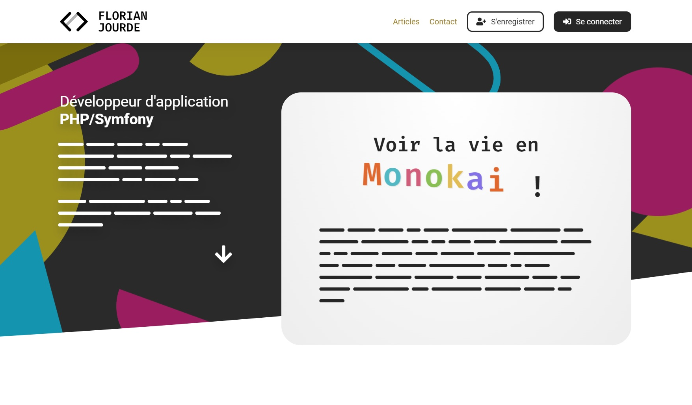

# OpenClassrooms
- Développeur d'application
- Parcours PHP/Symfony
- Projet 5

## Créez votre premier blog en PHP



[](https://app.codacy.com/gh/FlorianJourde/OpenClassrooms-5-Create-your-first-blog-in-PHP/dashboard) [](https://www.php.net/) [](https://twig.symfony.com/) [](https://getcomposer.org/)

### À propos

Bonjour et bienvenue sur le dépôt de mon travail, qui traite du cinquième projet d'OpenClassrooms, intutulé **Créez votre premier blog en PHP** ! Vous trouverez, ci-après, la procédure d'installation pour prendre en main le code du projet, ainsi que la base de données et sa structure, conçue pour fonctionner avec.

Vous trouverez également, dans le dossier **diagrams**, les diagrammes UML conçus en amont du projet, ainsi que le compte rendu de qualité de code, disponible en cliquant sur le bouton **Codacy**, présent ci-dessus.

[](https://florianjourde.com/)

**PHP • Twig • JS • CSS • MVC • POO**

---

## Remarque

Pour pouvoir installer ce projet, le gestionnaire de dépendance **Composer** doit être présent sur votre machine, ainsi qu'un serveur local sous **PHP 7.4**. Si vous ne disposez pas de ces outils, vous pourrez les télécharger et les installer, en suivant ces liens :
- Télécharger [Composer](https://getcomposer.org/)
- Télécharger [Wamp](https://www.wampserver.com/) (Windows)
- Télécharger [Mamp](https://www.wampserver.com/) (Mamp)

---

## Installation

1. À l'aide d'un terminal, créez un dossier à l'emplacement souhaité pour l'installation du projet. Lancez la commande suivante :
```shell
git clone https://github.com/FlorianJourde/OpenClassrooms-5-Create-your-first-blog-in-PHP.git
```

2. Lancez cette commande pour vous rendre dans le dossier adequat :
```shell
cd OpenClassrooms-5-Create-your-first-blog-in-PHP
```

3. À la racine de ce répertoire, lancez la commande suivante pour installer les dépendances Composer :
```shell
composer install
```

4. Vous devez maintenant modifier le fichier `DatabaseConnection.php` situé dans `\5-Blog-en-PHP\src\lib`. Remplacez `username`, `password`, ainsi qu'éventuellement `localhost` (si nécéssaire) par vos identifiants de base de données locale :
```php
<?php

namespace Application\Lib;

class DatabaseConnection
{
    public ?\PDO $database = null;

    public function getConnection(): \PDO
    {
        if ($this->database === null) {
            $this->database = new \PDO('mysql:host=localhost;dbname=florianjourde;charset=utf8', 'username', 'password');
        }

        return $this->database;
    }
}
```

5. Ensuite, importez simplement le fichier `florianjourde.sql`, présent à la racine du projet, dans votre base de données SQL locale. Si toutes les informations ont correctement été renseignées, la connexion devrait se faire automatiquement.

6. Créez votre hôte virtuel, pointant vers le dossier **public** du projet afin de pouvoir l'ouvrir avec une URL locale.

7. Pour pouvoir tester les controllers, veuillez utiliser les identifiants par défaut :
- Admin
    - ID : admin@admin.com
    - MDP : 123456
- User
    - ID : user@user.com
    - MDP : 123456
    
8. Si vous souhaitez pouvoir tester les emails directement depuis votre serveur local, il sera nécessaire d'utiliser [Fake Sendmail](https://www.glob.com.au/sendmail/). Je vous invite à suivre ce tutoriel, qui vous indiquera la procédure à suivre pour l'installer :
- [Envoyer des mails en local avec Wamp](https://grafikart.fr/blog/mail-local-wamp)

Si vous utilisez Gmail et que vous rencontrez des problèmes de connexion au service, veuillez prêter attention au second commentaire, laissé par `hamza.essamami.sio@gmail.com`.

### Merci pour votre attention !
